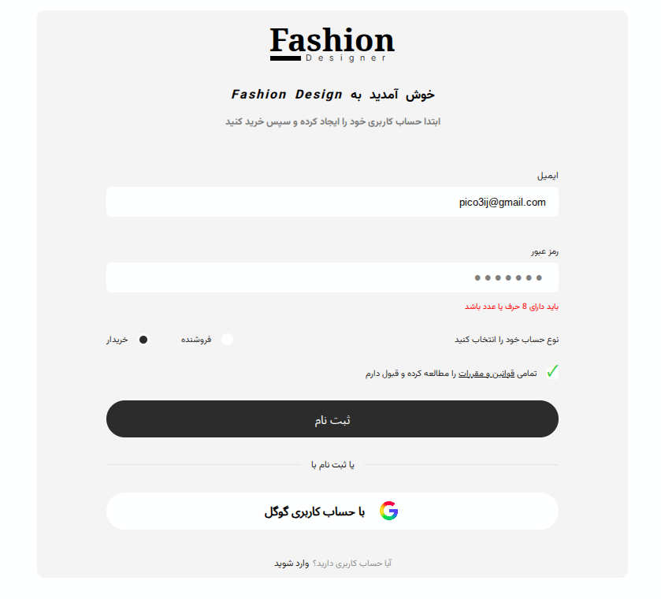

# Fashion-Login-Page
A clean and modern registration page for a fashion brand, featuring user registration, account type selection, password validation, terms and conditions, and Google sign-in. Built with HTML, CSS, and JavaScript.

# Preview

# Fashion Designer

A clean and modern registration page for a fashion brand, built with HTML, CSS, and JavaScript.

## Features

- 📝 User registration form
- 📧 Email input
- 🔒 Password validation
- 👤 Account type selection
- ✅ Terms and conditions checkbox
- 🔑 Google sign-in option
- 🔗 Login link for existing users

## Technologies Used

- HTML
- CSS
- JavaScript

## About

I created this project as a practice project to improve my front-end development skills.

It helped me practice building forms, styling user interfaces, handling user input, and adding interactive functionality with JavaScript.

I hope you like it!
